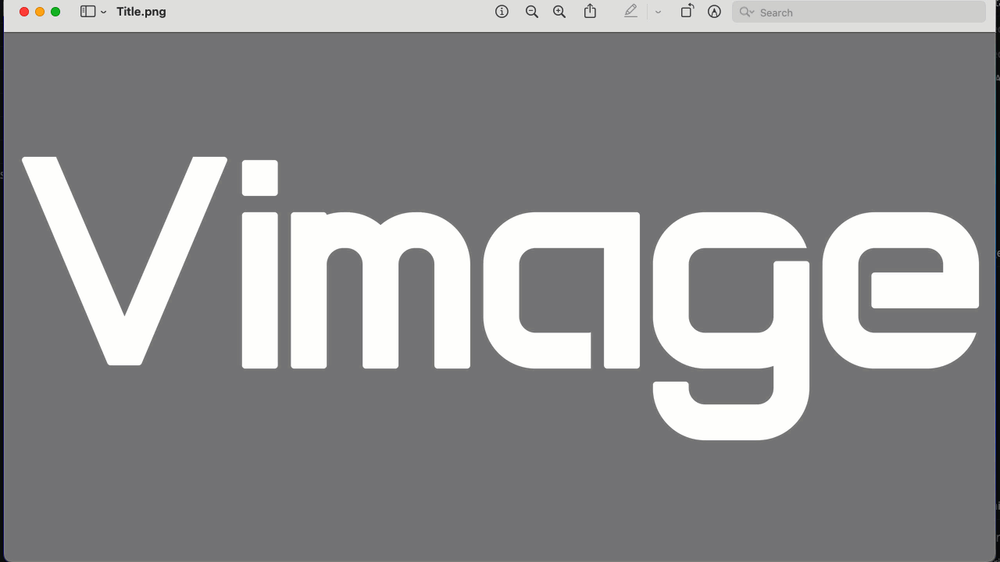
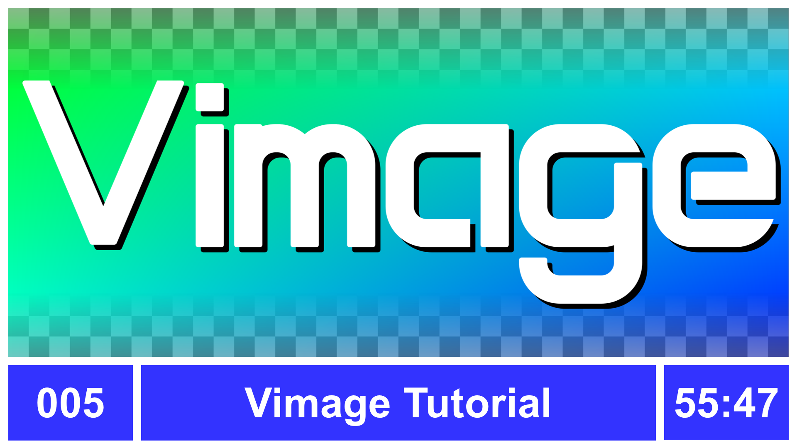

# Vimage

Summary   | Current Release
----------|-----------------------
Version   | 1.17
Date      | March 23, 2025
Platforms | Windows, macOS, Linux
Change Log| [Change Log](ChangeLog.md)
License   | [MIT License](LICENSE)
Author    | Brom Bresenham

# About
Vimage is a console-based image manipulator with a Vim-style user interface.

Vimage uses character block graphics to display and edit JPEGs, PNGs, and BMPs in 24-bit truecolor where possible. Windows and Linux consoles support truecolor out of the box. "Terminal" built in to macOS only supports an 8-bit color display but iTerm2 on macOS supports truecolor.

Vimage focuses on general image manipulations such as resizing, cropping, flipping, rotating, splitting, and joining. It does not currently offer pixel-level editing.

# Demos

# Tutorial

# Installation

## New Installation

1. Install [morlock.sh](https://morlock.sh)
2. `morlock install brombres/vimage`

## Updating Existing Installation
`morlock update vimage`

# Usage

    vimage

    vimage paths/to/files/and/folders

# Key Commands

Precede a key command with a number to repeat the command that many times or apply the command to that many images, as appropriate - for example, `5n` horizontally joins 5 images, starting with the current image.

Key    | Command              | Description
-------|----------------------|----------------------------------------------------------------------
`a`    | Apply Macro          | Applies the current command macro (recorded with `q`) to the current image.
`A`    | Apply Macro To All   | Applies the current command macro (recorded with `q`) to the current image and all images below.
`c`    | Crop Mode            | Enters Crop Mode. `[h,j,k,l]` crop 1 pixel off the left/bottom/top/right, respectively. `[H,J,K,L]` expands by one pixel, using the `:bg` color to fill the gap. `100j` crops 100 pixels off the bottom, etc. `t` trims fully transparent pixels from all sides. Tap `ESCAPE` to exit Crop Mode.
`d`    | Delete/Cut           | Deletes the current image and copies it to the clipboard.
`e`    | mErge                | Merges the current image on top of the one below it using alpha blending. Use e.g. `4e` to merge the current image and 3 images below it into a single image.
`f`    | Flip Horizontal      | Flips (mirrors) the current image horizontally.
`F`    | Flip Vertical        | Flips (mirrors) the current image vertically.
`g`    | Go to First Image    | [Image List] Selects the first image in the image list.
&nbsp; | Jump to Top          | [Zoom/Crop] Pans the image window to make the top side of the image visible.
`G`    | Go to Last Image     | [Image List] Selects the last image in the image list.
&nbsp; | Jump to Bottom       | [Zoom/Crop] Pans the image window to make the bottom side of the image visible.
`j`,`k`| Next/Previous Image  | Selects the next or previous image in the Image List to view or edit.
`J`,`K`| Shift List Position  | Shifts the current image up or down in the Image List, reordering the list.
`n`    | Join Horizontal      | Joins (splices) the current image with the one below it, placing them side-by-side horizontally.
`N`    | Join Vertical        | Joins (splices) the current image with the one below it, stacking them vertically.
`p`    | Paste Above          | Pastes the clipboard image above the current image in the Image List.
`P`    | Paste Below          | Pastes the clipboard image below the current image in the Image List.
`q`    | Record Macro         | Tap `q` to begin recording a macro, enter any commands desired, and then tap `q` again to stop recording the macro. Use `a` to replay the current macro on the currently-selected image.
`r`    | Rotate Clockwise 90º | Rotates the current image clockwise by 90º.
`R`    | Rotate CCW 90º       | Rotates the current image counter-clockwise by 90º.
`u`    | Undo                 | Undo the last editing command (the most recent 50 commands can be undone).
`U`    | Redo                 | Redo the last editing command that was just undone. Can also use `CONTROL+R` to Redo.
`y`    | Yank/Copy            | Yank a copy of the current image into the clipboard.
`z`    | Zoom In              | Enter Zoom Mode and zoom in to the current image. Use `[i,j,k,l]` to pan around. Use `Z` to zoom out and `ESCAPE` to exit Zoom Mode.
`Z`    | Zoom Out             | Enter Zoom Mode and zoom out of the current image. Use `[i,j,k,l]` to pan around. Use `z` to zoom in and `ESCAPE` to exit Zoom Mode.
`0`    | Default Zoom         | Resets the current image zoom level to the default, which fits the image to the window.
`0+SHIFT` | Maximum Zoom      | Sets the zoom level to maximum.
`.`    | Repeat Last          | Repeats the last editing command.
`:`    | Command Line         | Begins input of a command line (see [Command Line Commands](#Command-Line-Commands)).
`"`    | Toggle Clipboard     | Toggles between using the OS clipboard (default) and the internal clipboard for operations `d` (delete/cut), `y` (yank/copy), and `p` (paste). The OS clipboard allows image copy/paste between Vimage and other apps but can be slower when dealing with large images.
`!`    | Bitwise NOT          | Inverts the RGB pixel values of the current image.
`#`    | Jump to Left Side    | Pans the image window to make the left side of the image visible.
`$`    | Jump to Right Side   | Pans the image window to make the right side of the image visible.
`+`    | Add                  | Adds the pixels of this image to the image below.
`&`    | Bitwise AND          | Combine this image with the image below using a bitwise AND operation.
`\|`    | Bitwise OR           | Combine this image with the image below using a bitwise OR operation.
`~`    | Bitwise XOR          | Combine this image with the image below using a bitwise XOR operation.
`<`    | Bitwise ROL          | Rotate the RGB pixel bit values left by 1 bit. Use e.g. `8<` to ROL 8 bits, etc.
`>`    | Bitwise ROR          | Rotate the RGB pixel bit values right by 1 bit. Use e.g. `8>` to ROR 8 bits, etc.
`*`    | Multiply             | Combine this image with the image below using a color multiply operation.

# Command Line Commands
Type `:` to begin a Command Line command. Type one of the following and then tap `ENTER` to execute or `ESCAPE` to cancel.

Command   | Arguments       | Description
----------|-----------------|----------------------------------------------------------------------
`:anchor`   | `[center\|top\|left\|bottom\|right]+` `[c\|t\|l\|b\|r]+` | Sets the anchor used when when an image is cropped or expanded.
`:aspect`   | `[16:9\|3:4\|...]`  | Crops the image as necessary to achieve the specified aspect ratio.
`:aspect-fill` | `[WxH\|Wx\|xH]`     | Crops, expands, and/or resizes the current image to aspect-fill the specified size, retaining the same aspect ratio while completely filling the specified dimensions. Some content may be lost.
`:aspect-fit`  | `[WxH\|Wx\|xH]`     | Crops, expands, and/or resizes the current image to aspect-fit the specified size, retaining the same aspect ratio while fitting all content within the specified dimensions. The result may be letterboxed or pillarboxed.
`:bg`       | `[V\|RGB\|ARGB\|RRGGBB\|AARRGGBB]` `[t\|transparent\|white\|red\|...\|random]` | Sets the background color used for `:new` images and for expanded areas of an existing image.
`:channel` | `<operation-name> [ARGS]` | Manipulates the color channels. Refer to the [Channel Operations](#Channel-Operations) table for more information.
`:crop`     | `WxH` `[t|l|b|r]*` | Crop/expand to size WxH (e.g. `:crop 640x480`). If W and H are real numbers then they are treated as proportions - `:crop 0.5x2.0` crops half the width and expands to twice the height. An optional anchor may be specified.
`:crop`     | `Wx` `[c|t|l|b|r]*` | Crop/expand to width W, preserving the current height. Optional second arg is anchor, e.g. 'center', 't' or 'tl'. ':anchor' setting is used if anchor arg not supplied.
`:crop`     | `xH` `[c|t|l|b|r]*` | Crop/expand to height H, preserving the current width. Optional second arg is anchor, e.g. 'center', 't' or 'tl'. ':anchor' setting is used if anchor arg not supplied.
`:crop`     | `N`               | Crop N pixels on all sides. If N is negative then sides are expanded instead.
`:crop`     | `LEFT TOP RIGHT BOTTOM` | Crop/expand the specified number of pixels on each side. `:crop 1 -2 0 1` crops the left and bottom by 1 pixel and expands the top by 2 pixels.
`:extract`  | `a<255,r==0,...` | Extracts all the pixels from the current image to a new image that match the specified color component range. Operator `=` is the same as `==` and `!=` is not supported.
`:fill` | `COLOR`\ `TOP BOTTOM` `TL TR BL BR` `COLORS` | Fills the current image with a single color, a color gradient that uses either 2 top and bottom colors or 4 corner colors, or a horizontal color gradient that uses 3, 5, or more colors.
`:fillalpha` | `COLOR`\ `TOP BOTTOM` `TL TR BL BR` `COLORS` | Similar to ':fill' except preserves rgb values and only fills alpha color.
`:fillrgb` | `COLOR`\ `TOP BOTTOM` `TL TR BL BR` `COLORS` | Similar to ':fill' except preserves alpha values and only fills RGB color.
`:filter` | `<filter-name> [ARGS]` | Applies an image filter. Refer to the [Filters](#Filters) table for more information.
`:generate` | `<generator-name> [ARGS]` | Generates new pixel data in the current image. Refer to the [Generators](#Generators) table for more information.
`:ha`       |                 | Toggle "hard alpha" view on or off. When hard alpha is on, any pixel that is not completely transparent is shown as completely opaque. This helps ensure that translucent pixels are not accidentally cropped off.
`:info`     | `range`           | Report image information. `range` reports the highest and lowest brightness values among an image's pixel RGB components, ranging from 0 to 255.
`:join`     | `WxH [patch]`     | Join or splice the next W\*H images together in a WxH grid. If 'patch' is specified, a sizing guide strip is added to the top if H==1 (font strip) or all four sides if H>1 (9-patch image).
`:join`     | `WxH blend [<percent>%|<pixels>] [wrap]` | Join or splice the next W\*H images together in a WxH grid. The tile seams are blended together by the specified amount (default 25%). If 'wrap' is specified then the last tile is blended into the first tile.
`:name`     | `<filename>`      | Renames the current image but does not save the renamed image.
`:new`      | `WxH`             | Creates a new image of the specified pixel size, inserting it below the current image.
`:NEW`      | `WxH`             | Like `:new` but inserts the result ABOVE the current image.
`:open`     | `<filepaths>`     | Opens one or more specified images and adds them to the Image List.
`:q`        |                 | Quits (closes) the current image. Will be unsuccessful if the image has modifications.
`:q!`       |                 | Quits (closes) the current image, even if it has modifications.
`:qq`       |                 | Quits all images and ends Vimage. Will be unsuccessful if any image has modifications.
`:qq!`      |                 | Quits all images, even if some of them have modifications.
`:resize`   | `[WxH\|Wx\|xH]`     | Resizes the current image. "Wx" and "xH" variations retain the current aspect ratio while specifying a new size for one dimension.
`:rm`       |                 | Removes (deletes) the file for the current image from the filesystem. Useful for cleaning up an image folder by deleting unwanted images.
`:save`     | `[filepath]`      | An alias for `:w`.
`:shift`    | `X Y [wrap|w]`    | Shifts the image. The current ':bg' color is used for shifted-in pixels.
`:split`    | `WxH`             | Splits the current image into W\*H images. For example, `:split 4x2` assumes the current image is 4 tiles wide and 2 tiles high and splits the image into 8 separate tile images.
`:split`    | `patch`           | Auto-determines whether image has a sizing guide only on the top (font strip) or on all four sides (9-patch image) and then splits the image into its separate tiles.
`:trim`     | `[t|l|b|r]`       | Trims fully transparent pixels from the specified sides, or all sides if none specified.
`:w`        | `[filepath]`      | Writes (saves) the current image, optionally specifying a new filepath.
`:wall`     |                   | Writes (saves) all modified images.
`:wq`       |                   | Writes (saves) and quits (closes) the current image.
`:&`        | `[V\|RGB\|ARGB\|RRGGBB\|AARRGGBB]` | Bitwise-AND's each pixel in the current image with the specified constant value.
`:\|`       | `[V\|RGB\|ARGB\|RRGGBB\|AARRGGBB]` | Bitwise-OR's each pixel in the current image with the specified constant value.
`:~`        | `[V\|RGB\|ARGB\|RRGGBB\|AARRGGBB]` | Bitwise-XOR's each pixel in the current image with the specified constant value.
`:<`        | `N`               | Left-rotates the RGB bits by N pixels. Does not affect the alpha bits. Example: `:< 8`.
`:<`        | `N a`             | Left-rotates the ARGB bits by N pixels. Example: `:< 8 a`.
`:>`        | `N`               | Right-rotates the RGB bits by N pixels. Does not affect the alpha bits. Example: `:> 8`.
`:>`        | `N a`             | Right-rotates the ARGB bits by N pixels. Example: `:> 8 a`.
`:+`        | `[V\|RGB\|ARGB\|RRGGBB\|AARRGGBB]` | Adds the specified constant color to each pixel in the current image.
`:*`        | `[V\|RGB\|ARGB\|RRGGBB\|AARRGGBB]` | Color-multiplies each pixel in the current image by the specified constant color.

# Channel Operations

    :channel <operation-name> [ARGS]

Operation Name    | Arguments  | Description
---------------|------------|------------
copy           | `[a\|r\|g\|b\|XX]` `[a\|r\|g\|b]+` | Copy the specified source channel (a,r,g,b) or a constant channel value (such as `7f`) to one or more destination channels. To copy red to green and blue channels: `:channel copy r gb`. See also: `:channel swap`.
hsvtorgb       | &nbsp;     | The corollary to `:channel rgbtohsv`, this assumes the current image contains HSV color components and converts them to RGB color components.
rgbtohsv       | &nbsp;     | Converts the current image's RGB color components into HSV (Hue Saturation Value, also called HSB or Hue Saturation Brightness) color components. Each pixel's "red" value now indicates hue (0-255), "green" is saturation (0-255), and "blue" is brightness (0-255). These channels can be further manipulated using commands such as `:&`, `:|`, and `:clamp`. Then the image can be converted back into RGB with the command `:channel hsvtorgb`.
swap           | `[a\|r\|g\|b]` `[a\|r\|g\|b]` | Swaps one color channel with another. For example, `:channel swap r b` swaps the red and blue channels. See also: `:channel copy`.

# Filters

    :filter <filter-name> [ARGS]

Filter Name    | Arguments  | Description
---------------|------------|------------
brightgold     | &nbsp;     | Map max(R,G,B) to gradient [Black,Orange,Yellow,White]
clamp          | `LOCOLOR HICOLOR` | Limits the range of each pixel's color components to the corresponding low and high byte of the specified ARGB values. For example, `clamp 048 FCA` limits each red component to the range 00-FF, each green component to 44..CC, and each blue component to 88..AA.
gold           | &nbsp;       | Map gray(R,G,B) to gradient [Black,Orange,Yellow,White]
gray, grey     | `[RW GW BW]` | rgb = rgb( r\*RW + g\*GW + b\*BW ) Weights are normalized. Default 299 587 114.
hardalpha      | &nbsp;       | Sets pixels with nonzero alpha values to have alpha 255.
normalize      | [low high] (defaults: 0 255) | Normalizes brightness. The existing brightness range is remapped onto the full brightness range 0..255 or other specified range.
seamless       | `[h|v] [<percent>% | <pixels>]` | Creates a seamless tile by splitting and transposing halves, adding a translucency gradient, and merging back over the original image. Optionally specify e.g. '50%' to edge-blend just 50% of the image or e.g. '50' to edge-blend just 50 pixels. Optionally specify 'h' for horizontal only, 'v' for vertical only.

# Generators

    :generator <filter-name> [ARGS]

Filter Name    | Arguments  | Description
---------------|------------|------------
perlin         | [frequency] (default: 8.0) | Generates Perlin Noise.
